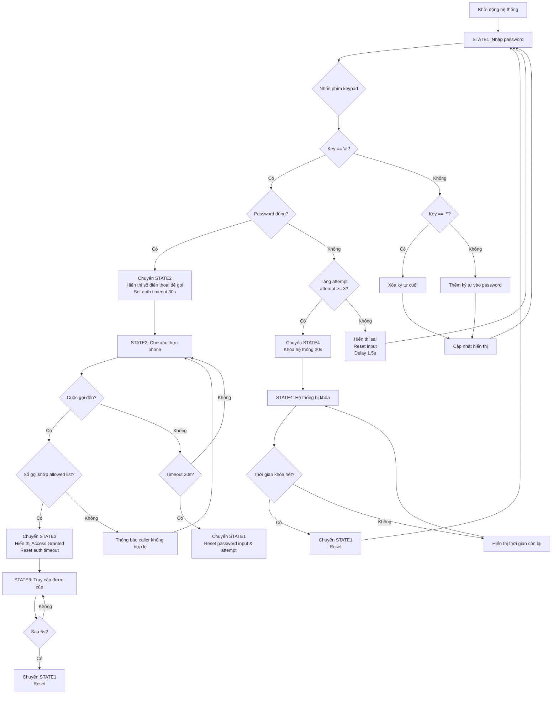

# Sơ đồ lưu đồ giải thuật hệ thống viễn thông

Dựa trên code của hệ thống, đây là sơ đồ lưu đồ giải thuật chính sử dụng state machine.

## Giải thích các trạng thái

- **STATE1**: Nhập mật khẩu qua keypad. Hỗ trợ xóa (*) và xác nhận (#).
- **STATE2**: Chờ cuộc gọi đến từ số điện thoại được phép trong danh sách allowed.
- **STATE3**: Truy cập được cấp, hiển thị thông báo thành công.
- **STATE4**: Hệ thống bị khóa do nhập sai mật khẩu quá nhiều lần.

## Các thông số chính

- Mật khẩu mặc định: 1234567
- Số lần thử tối đa: 3
- Thời gian khóa: 30 giây
- Thời gian xác thực: 30 giây
- Thời gian hiển thị access granted: 5 giây
